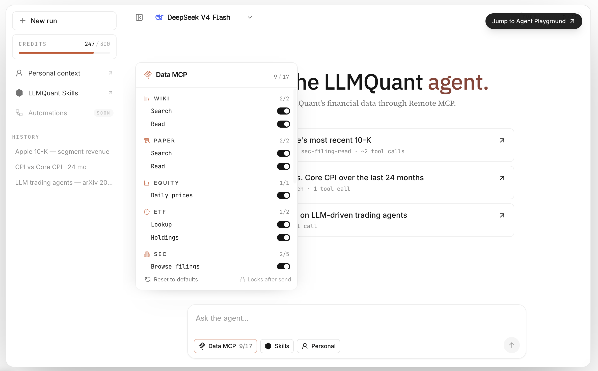

<div align="center">


<p><strong>English</strong> · <a href="README.zh-CN.md">简体中文</a></p>

<p>
  <a href="https://github.com/LLMQuant/skills/stargazers"></a>
  <a href="LICENSE"></a>
  <a href="https://github.com/LLMQuant/data-mcp"></a>
  <a href="https://llmquantdata.com/agent"></a>
  <a href="README.zh-CN.md"></a>
  <a href="https://github.com/LLMQuant/skills/commits"></a>
</p>

</div>

Reusable Agent Skills for Claude Code, Claude.ai, Cursor, and Codex, grounded in **LLMQuant Data**.

This repository is a skill catalog. The install/import unit is a category skill folder under `skills/llmquant-*`, not an isolated `SKILL.md` file and not a single workflow file.

```text
skills/
├── llmquant-data/
│   ├── SKILL.md
│   ├── workflows/
│   ├── scripts/
│   └── assets/
├── llmquant-etfs/
│   ├── SKILL.md
│   └── workflows/
└── ...

.claude-plugin/
.cursor-plugin/
.codex-plugin/
README.md
README.zh-CN.md
install.sh
```

Each category `SKILL.md` is a router. It indexes workflows in `workflows/*.md`, tells the agent which workflow to load, and enforces the LLMQuant Data evidence contract.

## Category Skills

| Skill | Scope | Key workflows |
|---|---|---|
| [`llmquant-data`](skills/llmquant-data) | LLMQuant Data primitives and source-grounded research. | 10-K risk review, 13F holders, U.S. macro snapshot, macro brief |
| [`llmquant-equities`](skills/llmquant-equities) | Equity research, comparison, valuation, catalysts, and sell discipline. | Five-lens analysis, equity compare, research memo, merger arb, take-profit lab |
| [`llmquant-etfs`](skills/llmquant-etfs) | ETF holdings, overlap, concentration, and exposure analysis. | ETF overlap report |
| [`llmquant-options`](skills/llmquant-options) | Options, volatility, Greeks, unusual activity, and option backtests. | IV rank, strategy builder, Greeks dashboard, P&L simulator, volatility surface |
| [`llmquant-equity-derivatives`](skills/llmquant-equity-derivatives) | Single-stock derivative and hybrid security research. | Single-stock derivative playbook, convertible and warrant lens |
| [`llmquant-commodities`](skills/llmquant-commodities) | Commodity spot, futures curve, inventory, and macro linkage work. | Commodity market lens, futures curve monitor |
| [`llmquant-crypto`](skills/llmquant-crypto) | Crypto regime, token research, perpetual funding, basis, and leverage monitoring. | Crypto market regime, token research, perp funding monitor |
| [`llmquant-prediction-markets`](skills/llmquant-prediction-markets) | Event odds, prediction-market contracts, probability gaps, and cross-venue arb review. | Event probability brief, arb watch, probability vs options pricing |
| [`llmquant-macro`](skills/llmquant-macro) | Macro dashboards, central-bank previews, liquidity, growth, inflation, and portfolio impact. | Global macro dashboard, Fed policy preview, macro-to-portfolio impact |
| [`llmquant-credit`](skills/llmquant-credit) | Issuer credit, spread regimes, high-yield stress, refinancing, and default risk. | Issuer credit risk review, credit spread regime, high-yield stress monitor |
| [`llmquant-rates-fx`](skills/llmquant-rates-fx) | Rates, yield curves, central-bank divergence, FX carry, and currency risk. | Yield curve trade lens, central-bank divergence, FX carry dashboard |
| [`llmquant-events`](skills/llmquant-events) | Earnings, M&A, regulatory, legal, policy, and catalyst event monitoring. | Earnings event brief, M&A event tracker, regulatory risk monitor |
| [`llmquant-portfolio`](skills/llmquant-portfolio) | Company profiles, thesis tracking, watchlists, alerts, and themes. | Company profile, thesis tracker, theme research, watchlist monitor, alert manager |
| [`llmquant-portfolio-lab`](skills/llmquant-portfolio-lab) | Portfolio exposure maps, what-if simulations, and virtual portfolio states. | Portfolio exposure map, portfolio what-if simulator |
| [`llmquant-risk`](skills/llmquant-risk) | Risk regime, hedging, panic scoring, and research quality checks. | Fear score, VIX status, hedge advisor, research health check |
| [`llmquant-strategies`](skills/llmquant-strategies) | Hedge-fund and PM strategy playbooks. | Equity long/short, long-biased, event-driven, macro, quant, multi-strategy |
| [`llmquant-market-intelligence`](skills/llmquant-market-intelligence) | Reusable market utilities and signal views. | Macro view, market sentiment, event probability signals |
| [`llmquant-investor-lenses`](skills/llmquant-investor-lenses) | Investor-style reasoning overlays using LLMQuant Data evidence. | Buffett, Graham, Munger, Lynch, Fisher, Burry, Ackman, Damodaran, and more |

## Install For Claude Code

Install one category skill globally:

```bash
mkdir -p ~/.claude/skills
git clone https://github.com/LLMQuant/skills.git /tmp/llmquant-skills
cp -R /tmp/llmquant-skills/skills/llmquant-options ~/.claude/skills/
```

Install one category skill into the current project:

```bash
mkdir -p .claude/skills
cp -R /tmp/llmquant-skills/skills/llmquant-options .claude/skills/
```

Then ask Claude Code:

```text
What skills are available?
```

Or invoke directly:

```text
/llmquant-options
```

## Install For Codex

Inside Codex, install a single category skill by GitHub directory URL:

```text
$skill-installer install https://github.com/LLMQuant/skills/tree/main/skills/llmquant-options
```

Restart Codex after installation.

For project-level use without the installer:

```bash
mkdir -p .agents/skills
cp -R /tmp/llmquant-skills/skills/llmquant-options .agents/skills/
```

Codex plugin metadata is in `.codex-plugin/plugin.json`.

## Install For Claude.ai

Claude.ai expects a ZIP containing the category skill folder:

```text
llmquant-options.zip
└── llmquant-options/
    ├── SKILL.md
    ├── workflows/
    ├── scripts/
    └── assets/
```

Upload it in:

```text
Customize > Skills > + Create skill > Upload a skill
```

Do not zip only the files at the root. The ZIP root should contain the category folder.

## Installer Scripts

From a clone:

```bash
./install.sh llmquant-options claude
./install.sh llmquant-etfs codex
./install.sh llmquant-portfolio claude project
```

Wrappers:

```bash
./installers/install-claude.sh llmquant-options
./installers/install-codex.sh llmquant-etfs
```

One-line install:

```bash
curl -fsSL https://raw.githubusercontent.com/LLMQuant/skills/main/install.sh | bash -s llmquant-options claude
curl -fsSL https://raw.githubusercontent.com/LLMQuant/skills/main/install.sh | bash -s llmquant-etfs codex
```

Set `LLMQUANT_SKILLS_REPO` if this repository is published under a different remote.

## Use With Native LLMQuant Data

LLMQuant Skills are designed to work best with the native **LLMQuant Data MCP** server: [`@llmquant/data-mcp`](https://github.com/LLMQuant/data-mcp). The MCP server connects Claude Code, Cursor, Codex CLI, Gemini CLI, and other MCP-enabled agents to LLMQuant Data through a single data layer.

The intended setup is:

1. Connect your agent to native LLMQuant Data.
2. Install one or more category skills from this repository.
3. Ask for an investment, trading, risk, macro, or portfolio workflow.
4. The skill selects the right workflow and describes the required data capabilities in natural language.
5. The agent routes those needs to the currently available LLMQuant Data MCP tools and reports dates, coverage, and missing inputs.


Get an API key from [llmquantdata.com](https://llmquantdata.com), then configure the MCP server for your client.

### Claude Code

```bash
claude mcp add llmquant-data \
  -e LLMQUANT_API_KEY=your_api_key \
  -- npx -y @llmquant/data-mcp
```

### Codex CLI

```bash
codex mcp add llmquant-data \
  --env LLMQUANT_API_KEY=your_api_key \
  -- npx -y @llmquant/data-mcp
```

### Cursor

Add this to `.cursor/mcp.json` in a project, or `~/.cursor/mcp.json` globally:

```json
{
  "mcpServers": {
    "llmquant-data": {
      "command": "npx",
      "args": ["-y", "@llmquant/data-mcp"],
      "env": {
        "LLMQUANT_API_KEY": "your_api_key"
      }
    }
  }
}
```

### Other MCP Clients

Any client that supports stdio MCP servers can use the same command:

```json
{
  "mcpServers": {
    "llmquant-data": {
      "command": "npx",
      "args": ["-y", "@llmquant/data-mcp"],
      "env": {
        "LLMQUANT_API_KEY": "your_api_key"
      }
    }
  }
}
```

Native LLMQuant Data currently exposes data capabilities across quant wiki knowledge, research papers, crypto prices, U.S. equity prices, macro indicators, SEC 10-K/10-Q filings, 13F smart-money holdings, and ETF holdings. More data products such as news, company fundamentals, earnings transcripts, options, commodities, prediction markets, credit, rates, FX, and portfolio data can be added behind the same skill contract over time.



<p align="center">
  <strong><a href="https://llmquantdata.com/agent">Open LLMQuant Agent Playground</a></strong>
</p>

These skills intentionally avoid binding workflow frontmatter to exact MCP tool names. Tool names can evolve, while the skill contract stays stable: describe the financial data needed, let the agent route to LLMQuant Data, and make the output disclose the evidence actually retrieved.

If `llmquant-data` is not connected, the skills still work as reusable research workflows. In that mode, the agent should ask for user-provided data, continue only with retrieved evidence, and clearly label missing native LLMQuant Data inputs.

## LLMQuant Data Contract

Every category skill treats **LLMQuant Data** as the input data source for external evidence:

- Use LLMQuant Data for prices, filings, 13F, macro, ETF holdings, crypto, prediction markets, rates, FX, credit, research, options, sentiment, profiles, watchlists, alerts, commodities, events, portfolio positions, and risk models.
- Describe data needs as natural-language capabilities in skills and workflows. Avoid binding frontmatter to exact MCP tool names so the agent can route to the currently available data MCP.
- State which data capabilities were used and cite returned dates, filing periods, observation dates, and stale-data notices.
- Do not invent missing values. If current coverage is unavailable, report the LLMQuant Data inputs needed by the workflow and continue only with retrieved evidence.
- Keep reasoning separate from evidence: skills define the analytical frame; LLMQuant Data supplies facts.

Some workflows define target LLMQuant Data capabilities that may be added later, such as option chains, commodity futures curves, prediction-market order books, credit spreads, FX forwards, portfolio positions, and portfolio scenario simulations. Those workflows should still exist as product-ready skills, with missing inputs clearly named when data is not yet returned.

## Contributing

Add or update workflows inside the relevant category:

```text
skills/llmquant-<category>/
├── SKILL.md
├── workflows/<workflow-name>.md
├── scripts/
└── assets/
```

Requirements:

- Category folders must be named `llmquant-*`.
- `SKILL.md` is the router and must index every workflow in the category.
- Workflow files contain the actual repeatable procedure, output format, data contract, and guardrails.
- External evidence should come from LLMQuant Data when available. If no data MCP is available, ask for user-provided data and clearly mark the limitation.
- Data requirements should be described as natural-language capabilities instead of exact MCP tool names in frontmatter.
- Update this README when adding, removing, or renaming a category or major workflow.

MIT License.

## Developed by

<div align="center">
  
  <br/>
  <strong><a href="https://llmquant.com">LLMQuant</a></strong>
  <br/>
  <sub>Open-source community for AI, LLMs, and quantitative finance.</sub>
  <br/><br/>
  <a href="https://llmquant.com">Website</a> ·
  <a href="https://github.com/LLMQuant">GitHub</a> ·
  <a href="https://linkedin.com/company/llmquant">LinkedIn</a>
</div>

The maintainer team reviews new entries and category changes.

## Star History

[](https://www.star-history.com/#LLMQuant/skills&Date)
