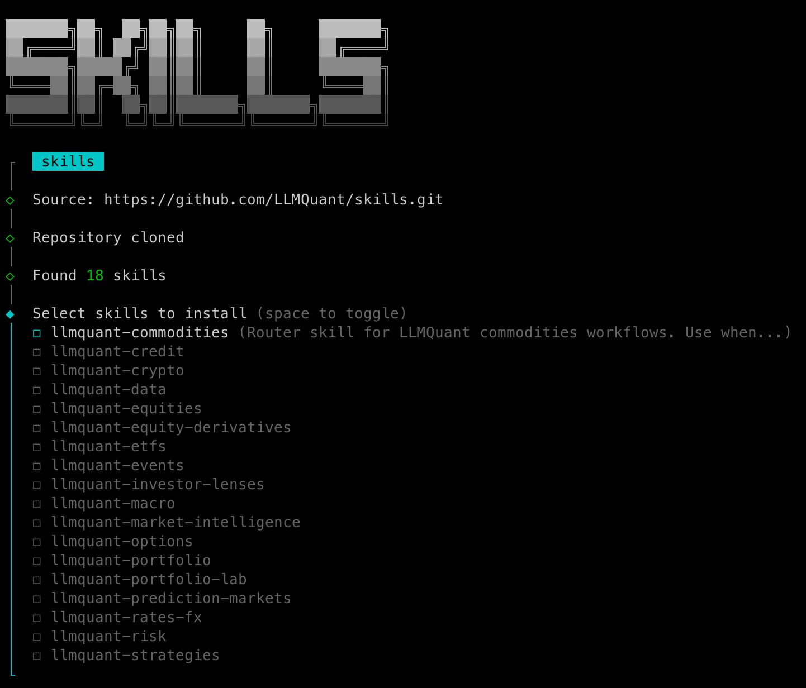

<div align="center">


<p><a href="README.md">English</a> · <strong>简体中文</strong></p>

<p>
  <a href="https://github.com/LLMQuant/skills/stargazers"></a>
  <a href="LICENSE"></a>
  <a href="https://github.com/LLMQuant/data-mcp"></a>
  <a href="https://llmquantdata.com/agent"></a>
  <a href="README.zh-CN.md"></a>
  <a href="https://github.com/LLMQuant/skills/commits"></a>
</p>

</div>

面向 Claude Code、Codex、Cursor、Antigravity 等 Agent 的可复用 Agent Skills，统一以 **LLMQuant Data** 作为外部证据输入。

```bash
npx skills add LLMQuant/skills      # Claude Code · Codex · Cursor · Antigravity · OpenClaw · Hermes · …
```

> 第一次用?安装细节(全局 / 指定 / 原生插件)见 [安装](#安装)。

这个 repo 是一个 skill catalog。用户安装/导入的基本单位是 `skills/llmquant-*` 下的一个大类 skill folder，不是孤立的 `SKILL.md`，也不是单个 workflow 文件。

```text
skills/
├── llmquant-data/
│   ├── SKILL.md
│   ├── workflows/
│   ├── scripts/
│   └── assets/
├── llmquant-etfs/
│   ├── SKILL.md
│   └── workflows/
└── ...

.claude-plugin/     # Claude Code 插件 + marketplace 清单
.codex-plugin/      # Codex 插件清单
.cursor-plugin/     # Cursor 插件清单
assets/
README.md
README.zh-CN.md
```

每个大类的 `SKILL.md` 是 router：它索引 `workflows/*.md`，告诉 Agent 该加载哪个 workflow，并强制执行 LLMQuant Data 证据约定。

## 大类 Skills

| Skill | 范围 | 主要 workflows |
|---|---|---|
| [`llmquant-data`](skills/llmquant-data) | LLMQuant Data 原语和基于数据源的研究。 | 10-K 风险审查、13F 持有人、美国宏观快照、宏观简报 |
| [`llmquant-equities`](skills/llmquant-equities) | 股票研究、横向比较、估值、催化剂和卖出纪律。 | Five-lens analysis、equity compare、research memo、merger arb、take-profit lab |
| [`llmquant-etfs`](skills/llmquant-etfs) | ETF 持仓、重叠、集中度和敞口分析。 | ETF overlap report |
| [`llmquant-options`](skills/llmquant-options) | 期权、波动率、Greeks、异常活动和期权回测。 | IV rank、strategy builder、Greeks dashboard、P&L simulator、volatility surface |
| [`llmquant-equity-derivatives`](skills/llmquant-equity-derivatives) | 单票衍生品和混合证券研究。 | Single-stock derivative playbook、convertible and warrant lens |
| [`llmquant-commodities`](skills/llmquant-commodities) | 商品现货、期货曲线、库存和宏观联动。 | Commodity market lens、futures curve monitor |
| [`llmquant-crypto`](skills/llmquant-crypto) | 加密资产市场体制、Token 研究、永续资金费率、基差和杠杆监控。 | Crypto market regime、token research、perp funding monitor |
| [`llmquant-prediction-markets`](skills/llmquant-prediction-markets) | 事件赔率、预测市场合约、概率差和跨场地套利检查。 | Event probability brief、arb watch、probability vs options pricing |
| [`llmquant-macro`](skills/llmquant-macro) | 宏观仪表盘、央行会议预览、流动性、增长、通胀和组合影响。 | Global macro dashboard、Fed policy preview、macro-to-portfolio impact |
| [`llmquant-credit`](skills/llmquant-credit) | 发行人信用、利差体制、高收益压力、再融资和违约风险。 | Issuer credit risk review、credit spread regime、high-yield stress monitor |
| [`llmquant-rates-fx`](skills/llmquant-rates-fx) | 利率、收益率曲线、央行分化、外汇 carry 和汇率风险。 | Yield curve trade lens、central-bank divergence、FX carry dashboard |
| [`llmquant-events`](skills/llmquant-events) | 财报、M&A、监管、法律、政策和催化剂事件监控。 | Earnings event brief、M&A event tracker、regulatory risk monitor |
| [`llmquant-portfolio`](skills/llmquant-portfolio) | 公司档案、论点跟踪、观察名单、提醒和主题研究。 | Company profile、thesis tracker、theme research、watchlist monitor、alert manager |
| [`llmquant-portfolio-lab`](skills/llmquant-portfolio-lab) | 组合敞口地图、what-if 模拟和虚拟组合状态。 | Portfolio exposure map、portfolio what-if simulator |
| [`llmquant-risk`](skills/llmquant-risk) | 风险体制、对冲、恐慌评分和研究质量检查。 | Fear score、VIX status、hedge advisor、research health check |
| [`llmquant-strategies`](skills/llmquant-strategies) | 对冲基金和 PM 策略手册。 | Equity long/short、long-biased、event-driven、macro、quant、multi-strategy |
| [`llmquant-market-intelligence`](skills/llmquant-market-intelligence) | 可复用市场工具和信号视图。 | Macro view、market sentiment、event probability signals |
| [`llmquant-investor-lenses`](skills/llmquant-investor-lenses) | 用 LLMQuant Data 做证据输入的投资大师推理覆盖层。 | Buffett、Graham、Munger、Lynch、Fisher、Burry、Ackman、Damodaran 等 |

## 安装

### 推荐 —— `npx skills add`

一条命令，适用于 Claude Code、Codex、Cursor、Antigravity、Gemini 等多种 Agent。

```bash
# 为当前 Agent 交互式选择要安装的 skill
npx skills add LLMQuant/skills

# 全局安装全部大类 skill
npx skills add LLMQuant/skills -g --all

# 只安装指定的几个
npx skills add LLMQuant/skills -g --skill llmquant-options llmquant-equities

# 指定某个 Agent
npx skills add LLMQuant/skills -a codex
```

用 `npx skills list`、`npx skills update`、`npx skills remove` 管理已安装的 skill。

安装后在 Agent 里问 `What skills are available?`，或直接调用，例如 `/llmquant-options`。



### 原生插件安装

整个仓库同时被打包成**一个插件**，一次性 bundle 所有大类 skill，供带原生插件系统的 Agent 使用。

**Claude Code** —— 把本仓库加为 plugin marketplace，再安装该 bundle：

```text
/plugin marketplace add LLMQuant/skills
/plugin install llmquant-skills@llmquant
```

**Codex** —— 仓库内含 `.codex-plugin/plugin.json`，已 plugin-ready。当前安装请用上面的 CLI（`npx skills add LLMQuant/skills -a codex`），或用 skill installer 安装单个大类 skill：

```text
$skill-installer install https://github.com/LLMQuant/skills/tree/main/skills/llmquant-options
```

**Cursor · Antigravity · 其他 Agent** —— 用推荐的 CLI 加上对应 agent，例如 `npx skills add LLMQuant/skills -a cursor` 或 `-a antigravity`。

## 结合原生 LLMQuant Data 使用

LLMQuant Skills 最适合与原生 **LLMQuant Data MCP** server 一起使用：[`@llmquant/data-mcp`](https://github.com/LLMQuant/data-mcp)。这个 MCP server 可以把 Claude Code、Cursor、Codex CLI、Gemini CLI 和其他支持 MCP 的 Agent 接入同一个 LLMQuant Data 数据层。

推荐的使用路径是：

1. 先把 Agent 接入原生 LLMQuant Data。
2. 再从本 repo 安装一个或多个大类 skill。
3. 向 Agent 提出投研、交易、风险、宏观或组合管理任务。
4. skill 选择合适的 workflow，并用自然语言描述需要哪些数据能力。
5. Agent 根据当前可用的 LLMQuant Data MCP 工具完成路由，并在输出中说明日期、覆盖范围和缺失输入。


先在 [llmquantdata.com](https://llmquantdata.com) 获取 API key，然后为你的客户端配置 MCP server。

### Claude Code

```bash
claude mcp add llmquant-data \
  -e LLMQUANT_API_KEY=your_api_key \
  -- npx -y @llmquant/data-mcp
```

### Codex CLI

```bash
codex mcp add llmquant-data \
  --env LLMQUANT_API_KEY=your_api_key \
  -- npx -y @llmquant/data-mcp
```

### Cursor

写入项目级 `.cursor/mcp.json`，或全局 `~/.cursor/mcp.json`：

```json
{
  "mcpServers": {
    "llmquant-data": {
      "command": "npx",
      "args": ["-y", "@llmquant/data-mcp"],
      "env": {
        "LLMQUANT_API_KEY": "your_api_key"
      }
    }
  }
}
```

### 其他 MCP 客户端

支持 stdio MCP server 的客户端可以使用同样的配置：

```json
{
  "mcpServers": {
    "llmquant-data": {
      "command": "npx",
      "args": ["-y", "@llmquant/data-mcp"],
      "env": {
        "LLMQUANT_API_KEY": "your_api_key"
      }
    }
  }
}
```

原生 LLMQuant Data 当前覆盖量化 wiki 知识、研究论文、加密资产价格、美股价格、宏观指标、SEC 10-K/10-Q 申报、13F smart-money 持仓和 ETF 持仓等数据能力。后续新闻、公司基本面、财报电话会、期权、商品、预测市场、信用、利率、外汇和组合数据，也可以沿用同一套 skill contract 接入。


<p align="center">
  <strong><a href="https://llmquantdata.com/agent">打开 LLMQuant Agent Playground</a></strong>
</p>

这些 skills 有意避免在 workflow frontmatter 里绑定具体 MCP tool name。工具名称未来可能变化，skill contract 保持稳定：描述金融数据需求，让 Agent 路由到 LLMQuant Data，并在输出中披露实际取回的证据。

如果没有连接 `llmquant-data`，这些 skills 仍然可以作为可复用研究 workflow 使用。此时 Agent 应要求用户提供数据，只基于已取回证据继续，并明确标注缺失的原生 LLMQuant Data 输入。

## LLMQuant Data 约定

每个大类 skill 都把 **LLMQuant Data** 作为外部证据输入：

- 使用 LLMQuant Data 获取价格、申报、13F、宏观、ETF 持仓、加密资产、预测市场、利率、外汇、信用、研究、期权、情绪、档案、观察名单、提醒、商品、事件、组合持仓和风险模型。
- 在 skill 和 workflow 中用自然语言描述所需数据能力，避免在 frontmatter 里绑定具体 MCP tool name，让 Agent 根据当前可用的数据 MCP 做路由。
- 输出中说明使用了哪些数据能力，并标注日期、申报期间、观测日期和 stale-data 提示。
- 不编造缺失值。如果当前覆盖不可用，明确说明该 workflow 需要哪些 LLMQuant Data 输入，并只基于已取回证据继续。
- 区分推理与证据：skill 提供分析框架，LLMQuant Data 提供事实输入。

部分 workflow 会定义未来可加入的 LLMQuant Data 能力，例如期权链、商品期货曲线、预测市场订单簿、信用利差、FX forwards、组合持仓和组合情景模拟。这些 workflow 仍然应该作为产品就绪的 skill 存在，只是在数据未返回时明确列出缺失输入。

## 贡献

在对应大类下新增或更新 workflow：

```text
skills/llmquant-<category>/
├── SKILL.md
├── workflows/<workflow-name>.md
├── scripts/
└── assets/
```

要求：

- 大类 folder 必须命名为 `llmquant-*`。
- `SKILL.md` 是 router，必须索引该大类下所有 workflow。
- workflow 文件负责真正的可复用步骤、输出格式、数据约定和约束。
- 外部证据优先来自 LLMQuant Data。没有可用数据 MCP 时，要求用户提供数据，并明确标注限制。
- 数据需求应描述成自然语言的数据能力，不要在 frontmatter 里绑定具体 MCP tool name。
- 新增、删除或重命名大类/主要 workflow 时更新本 README。

MIT License.

## Developed by

<div align="center">
  
  <br/>
  <strong><a href="https://llmquant.com">LLMQuant</a></strong>
  <br/>
  <sub>Open-source community for AI, LLMs, and quantitative finance.</sub>
  <br/><br/>
  <a href="https://llmquant.com">Website</a> ·
  <a href="https://github.com/LLMQuant">GitHub</a> ·
  <a href="https://linkedin.com/company/llmquant">LinkedIn</a>
</div>

维护团队会审核新的 workflow 条目和大类变更。

## Star History

[](https://www.star-history.com/#LLMQuant/skills&Date)
